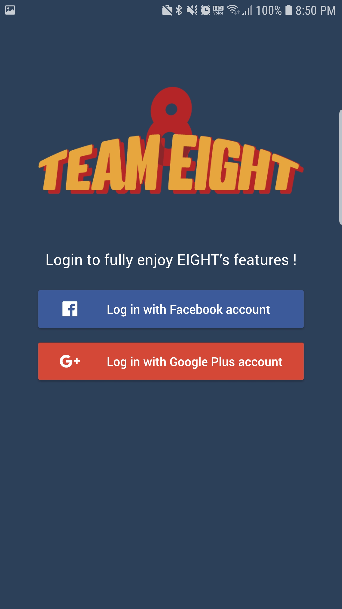
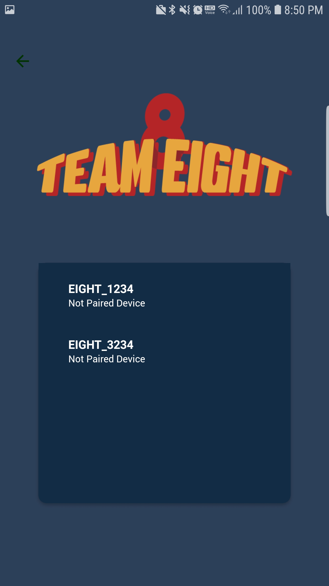
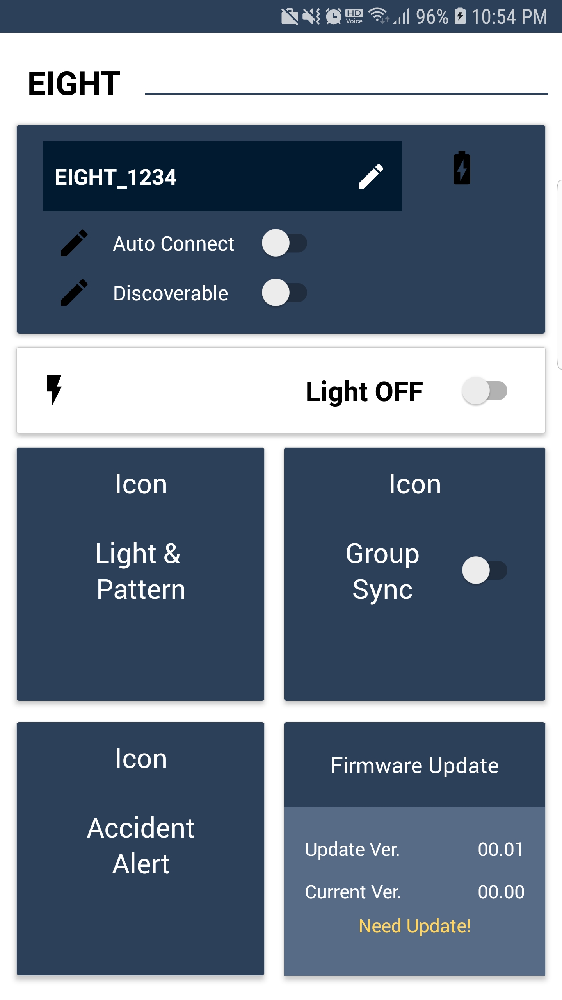
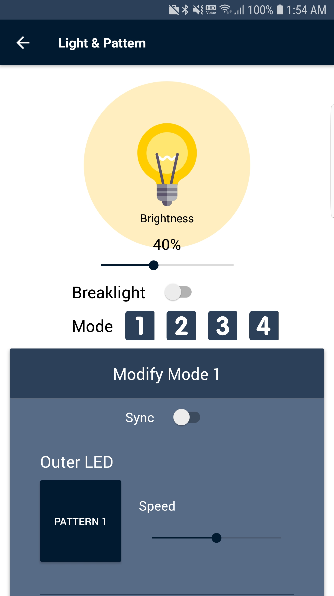
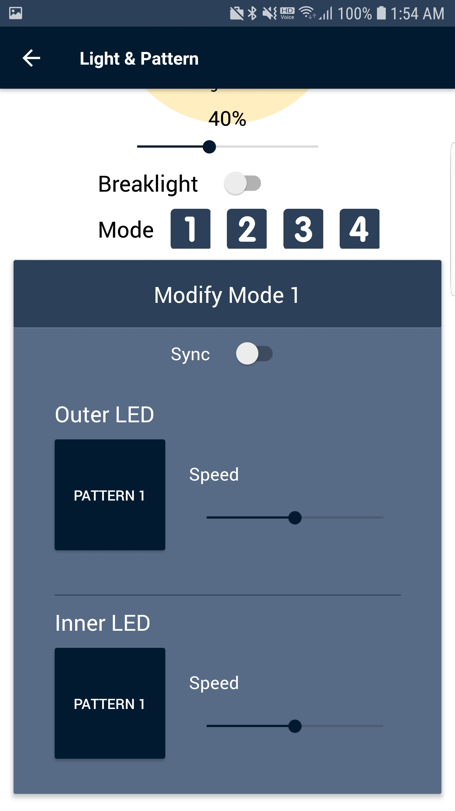
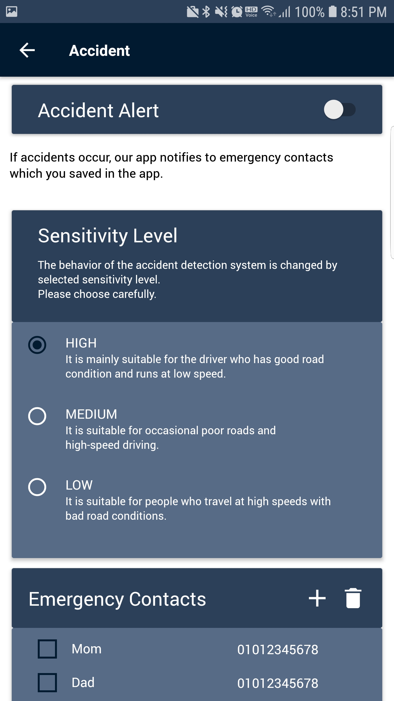
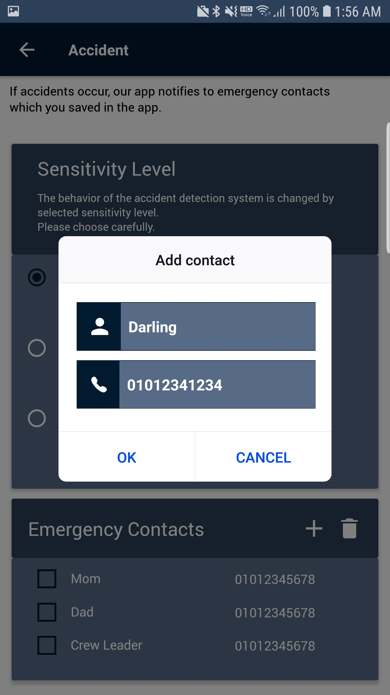
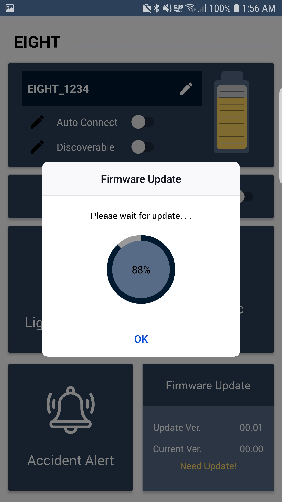

# TEAM EIGHT
- 2019-01 ~ ing
- 자전거, 이륜차 안전주행을 주제로 BLE 기기와 통신가능한 React Native App
- 주요 기능
  - 디바이스로 부터 센서 값을 전달받아 사고 인지 후 대응
  - 디바이스 led pattern 설정
  - firmware update (nordic embedded board)

| login | discover | main |
| - | - | - |
| |  |  |

| pattern | pattern | accident |
| - | - | - |
| |  |  |

| contact | firmware | x |
| - | - | - |
| |  ||
